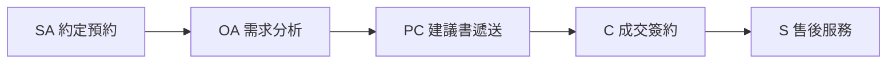

# 客戶案件管理系統 (CRM Canvas) — 完整功能與系統需求規格書 (SRS)

本規格書以現有 CRM 畫布系統之代碼為基礎，詳盡記錄各功能模組的設計用意、UI/UX 互動細節、底層資料結構以及核心商務邏輯。旨在為「新專案重構」提供一份精準、完整、無遺漏的開發導航說明。

---

## 1. 系統定位與設計美學

### 1.1 系統定位 (Target User & Scenario)
* **使用者對象**：ADHD 成人業務、金融保險銷售人員。
* **場景**：在行動裝置（平板或手機）上面向客戶進行展示，或作為日常高頻率、低認知負荷的案件推移畫布。
* **核心 UX 減法原則**：
  * **禁止資訊稠密**：主畫面僅呈現「當下這一秒需要處理」的核心流程，非核心欄位預設隱藏，僅在點擊進入「抽屜 (Drawer)」時滑出展示。
  * **多模態與快速點選**：減少文字打字輸入的負擔，多數操作均透過點擊、雙擊防呆以及自訂快捷選單完成。
  * **視覺聚焦**：底色採用極深色（暗黑霓虹模式），核心行動按鈕（如完成、確定狀態）採用高對比度的明亮色調（如亮綠、亮橘），確保 0.1 秒內聚焦。

### 1.2 視覺與美學規範 (Aesthetic Standards)
* **配色系統**：深色背景（Neon Dark Mode），以 CSS 變數定義：
  * 主要背景：極深黑（如 `#09090b` 至 `#11111b`）。
  * 節點與標籤霓虹色調：
    * **SA (約定預約)**：亮黃色（亮橘色）。
    * **OA (需求分析)**：藍色/紫藍色。
    * **PC (建議書遞送)**：紫色。
    * **C (成交簽約)**：綠色/青色。
    * **S (售後服務)**：靛藍色。
* **字體大小縮放 (RWD 親和)**：
  * 提供全網頁字型大小縮放控制（A- 與 A+ 按鈕），將字體基底大小存於 `localStorage`（範圍 12px ~ 22px），重載網頁時自動讀取。

---

## 2. 主介面佈局與頂部控制列

### 2.1 頂部狀態列與控制元件
* **標題**：客戶案件管理系統。
* **字級切換**：`A-` 與 `A+` 按鈕，單擊調整全站字級大小。
* **搜尋與歷史紀錄**：
  * 支援搜尋框（依據客戶姓名、準備議題等進行關鍵字模糊比對）。
  * 支援「搜尋歷史紀錄」下拉選單：記錄最近 5 筆搜尋關鍵字，存於 `localStorage`，可單擊快速套用或單擊 `✕` 刪除該條歷史。
* **系統設定按鈕 (⚙️)**：點擊開啟「系統設定彈窗」。
* **同步狀態指示燈 (Connection Status Bar)**：
  * **🟢 雲端已連線**：已成功與 Google Apps Script (GAS) 建立連線，任何變更即時背景同步。
  * **🟡 背景同步中 / 離線模擬中**：正在進行資料上傳，或使用者手動開啟「離線模式」。
  * **🔴 連線異常 (本機執行)**：連線失敗，點擊可滑鼠懸停顯示具體錯誤原因與排障引導。

### 2.2 週約訪看板 (Weekly Visit Calendar)
* **目的**：提供業務未來 7 天內已約定會面案件的快速可視化統計。
* **邏輯與呈現**：
  * 自動推算今日起算未來 7 天的日期與星期（如：今天、六、日、一...）。
  * 背景篩選：抓取所有案件當前階段所屬的會面日期（SA 比對 `agreeDate`，OA/PC/C/S 比對 `meetDate`）。若日期符合這 7 天內，計數 +1。
  * 卡片狀態：
    * 當天有約訪時（計數 > 0），卡片字體加亮，滑鼠指標變為 `pointer`，懸停顯示當日約訪名單。
    * **定位錨點功能**：單擊該天卡片，頁面會自動平滑滾動（`scrollIntoView`）至對應的客戶列，並對該客戶列進行「邊框霓虹閃爍高亮」反饋，持續 2 秒後自動消失。

---

## 3. 看板核心：階段主幹道與次標籤

看板以「客戶列」為單位，橫向展示銷售漏斗的 5 個核心階段：



### 3.1 階段節點與防呆雙擊 (Flow-Node Interactions)
每個階段在客戶列中呈現為一個圓形節點（SA, OA, PC, C, S），其單/雙擊邏輯如下：
* **單擊節點**：在右側或下方滑出該階段的「大抽屜 (Drawer)」進行細部欄位編輯。
* **雙擊節點 (防呆推移)**：
  * **前進階段**（例如從 OA 推進至 PC）：觸發 **NBS保障防呆鎖 (Risk Lock Modal)** 彈窗，要求業務必須與客戶進行保障焦點確認，完成後才允許變更進度。
  * **後退階段**（例如從 PC 回退至 OA）：無需解鎖，直接將 `currentPhase` 變更為目標階段，並彈出 `showToast` 回退提示，自動開啟對應抽屜。
* **平板/觸控裝置優化**：偵測觸控裝置，將雙擊判定延遲拉長至 300ms（滑鼠為 220ms），防止手指觸控時雙擊失靈。

### 3.2 階段大燈狀態 (Node Status)
大節點圓圈的亮燈顏色取決於該階段的細部屬性：
1. **Active (已完成狀態)**：該階段的核心終點任務已完成（大燈呈現高亮底色）。
2. **Preparing (準備中狀態)**：該階段有任何子任務已啟動、有輸入日期/備忘，或是案件當前進度落在該階段（大燈呈現呼吸霓虹外框）。
3. **Dim (未啟動狀態)**：完全沒有任何資料（大燈呈現灰色暗淡）。

---

## 4. 銷售流程次標籤 (Sub-tags) 雙擊防呆規則

為防止使用者在瀏覽主看板時手指誤觸，次標籤（每個階段圓圈下方的三個快捷小標籤）採用以下 **「單擊推進、雙擊防呆」** 的嚴格交互邏輯：

### 4.1 核心防呆狀態機
* **未亮燈狀態 ➡️ 亮燈 (單擊)**：
  * 次標籤處於暗淡（未亮燈）時，**單擊一次**即可直接推進至亮燈。
  * 系統會自動填入預設日期（今日）或留空，並**自動滑出對應大抽屜**，將焦點引導至日期選擇器。
* **已亮燈狀態 ➡️ 還原/切換 (雙擊防呆)**：
  * 次標籤處於亮燈狀態時，**單擊將被系統忽視（無任何反應）**，以防誤觸。
  * 必須 **快速雙擊（Double Click，即 `event.detail >= 2`）**，才可還原為未亮燈（清除日期）或切換至下一個亮燈狀態。

### 4.2 各階段次標籤細部狀態機
#### 【SA 階段次標籤】
1. **發出狀態**（未發出 ↔️ 已發出）
   * 未發出：單擊 ➡️ 變更為「已發出」，帶入今日日期為 `sendDate`。
   * 已發出：雙擊 ➡️ 還原為「未發出」，清空 `sendDate`。
2. **回覆狀態**（未回覆 ➡️ 互動中 ➡️ 無意願 ➡️ 未回覆）
   * 未回覆：單擊 ➡️ 變更為「互動中」，帶入今日日期為 `replyDate`，設定 `intentState` 為 `intent-pending`。
   * 互動中：雙擊 ➡️ 變更為「無意願」，設定 `intentState` 為 `intent-no`。
   * 無意願：雙擊 ➡️ 還原為「未回覆」，清空所有狀態與日期。
3. **約定狀態**（未約定 ➡️ 喬時間中 ➡️ 已約定 ➡️ 未約定）
   * 未約定：單擊 ➡️ 變更為「喬時間中」（`meetState = 'pending'`），並**自動滑出 SA 抽屜**引導填寫細節。
   * 喬時間中：雙擊 ➡️ 變更為「已約定」，自動將 `agreeState` 設為 `active`，約定日期設為今日，並聯動設定 OA 會面狀態為已確認。
   * 已約定：雙擊 ➡️ 還原為「未約定」，清空所有約定與會面資訊。

#### 【OA 階段次標籤】
1. **訪前規劃**：單擊亮燈並帶入今日為 `planDate` ➡️ 雙擊熄燈清空日期。
2. **訪前演練**：單擊亮燈並帶入今日為 `practiceDate` ➡️ 雙擊熄燈清空日期。
3. **訪後討論**：單擊亮燈並帶入今日為 `discussDate` ➡️ 雙擊熄燈清空日期.

#### 【PC 階段次標籤】
1. **規劃建議**：單擊亮燈並帶入今日為 `planDate` ➡️ 雙擊熄燈清空日期。
2. **已傳建議**：單擊亮燈並帶入今日為 `discussDate` ➡️ 雙擊熄燈清空日期。
3. **講解演練**：單擊亮燈並帶入今日為 `practiceDate` ➡️ 雙擊熄燈清空日期。

#### 【C 階段次標籤】
1. **照會防範**：單擊亮燈並帶入今日為 `planDate` ➡️ 雙擊熄燈清空日期。
2. **要保簽署**：單擊亮燈並帶入今日為 `practiceDate` ➡️ 雙擊熄燈清空日期。
3. **保費首扣**：單擊亮燈並帶入今日為 `discussDate` ➡️ 雙擊熄燈清空日期。

#### 【S 階段次標籤】
1. **保單送達**：單擊亮燈並帶入今日為 `planDate` ➡️ 雙擊熄燈清空日期。
2. **契撤追蹤**：單擊亮燈並帶入今日為 `practiceDate` ➡️ 雙擊熄燈清空日期。
3. **週年服務**：單擊亮燈並帶入今日為 `discussDate` ➡️ 雙擊熄燈清空日期。

---

## 5. 抽屜維護面板細節 (Drawer Details)

抽屜面板在觸發時從視窗右側（寬螢幕）或下方（行動端）滑出，分為「客戶基本資料抽屜」與「各階段詳細維護抽屜」。

### 5.1 客戶基本資料抽屜 (Client Detail Drawer)
* **編輯欄位**：
  * 客戶姓名、開拓管道、介紹人姓名、緣故標籤、聯絡資訊。
  * **拜訪類型**：分為「議題訪」與「生活訪」（Tab 切換）。
    * 生活訪專屬：顯示第二準備議題輸入框。
  * **議題輸入與自動完成 (Autocomplete)**：
    * 議題欄位在輸入中（`oninput`）或聚焦時（`onfocus`），會彈出議題自動完成下拉選單，其內容比對系統設定的 `globalTopics`。
    * 選取下拉項目後自動帶入輸入框，並儲存更新。
  * **客戶備忘錄**：大文字域。
  * **封存案件按鈕**：點選可將案件封存，封存後在主看板隱藏，僅在開啟「顯示已封存案件」時於列表末尾顯示。

### 5.2 階段詳細維護抽屜
每個階段抽屜的通用區塊均為三欄式或雙欄式佈局：
1. **改期歷史紀錄 (Reschedule History)**：
   * 專屬 PC 階段與成交階段：紀錄客戶更改面談約定時間的歷史。
   * 支援「登記新改期」：輸入改期後的新日期，自動產生一筆改期歷程紀錄，並更新當前預計會面日期。
2. **會面日期與時段**：
   * 預計會面日期：點擊拉出系統自訂日期選擇器。
   * 會面狀態：按鈕 Tab（喬時間中 / 時間已確定）。
   * 時間時段選擇器：提供「午餐前、午餐、下午一、下午二、晚餐、晚餐後」等快捷選擇按鈕。
3. **子任務檢查清單 (Checklist)**：
   * 包含該階段的三個核心步驟（如 PC 的規劃建議、已傳建議、講解演練）。
   * 提供 **「標記完成」** 按鈕：點擊後亮燈並帶入今日日期，並有對應的文字備忘錄輸入框。

---

## 6. 自訂日期選擇器 (Custom Date Picker)

為求在任何平板、手機或網頁上達到網格對齊、高對比的視覺反饋，系統**不使用瀏覽器內建的日期輸入框**，而是實作全自訂的 JS 日期選擇器：
* **定位邏輯**：點選日期輸入框時，動態取得該輸入框相對於視窗的 `BoundingClientRect`，將日曆容器以 `absolute` 定位精準貼齊在輸入框正下方。
* **功能**：
  * 單擊 `◄` 或 `►` 快捷切換月份（阻斷事件冒泡，防範抽屜關閉）。
  * 點擊日期格子：選取該日期、將格式化字串（`YYYY-MM-DD`）填入對應欄位，並關閉日曆。
  * **✕ 清除日期按鈕**：一鍵清空輸入框內容，並在資料庫中將對應日期欄位設為空字串，連動將大燈或狀態還原。
  * 點擊日曆外面任何區域：自動隱藏日曆。

---

## 7. 資料同步與離線防線機制 (Sync & Storage)

### 7.1 本機資料結構 (CRM Local Data Structure)
每一個案件（Case Object）在 `localStorage` 內都必須擁有完整的屬性定義。新增案件時，系統必須初始化以下結構，**缺一不可**，以防 `renderCases` 渲染渲染時發生 `TypeError`：

```json
{
  "id": "case-1719934250123",
  "clientName": "張三",
  "visitType": "issue",
  "preparedIssues": ["退休規劃"],
  "type": "life",
  "caseSource": "outbound",
  "source": "referral",
  "referrerName": "李四",
  "contactMethods": ["LINE"],
  "contactDetail": "line_id_123",
  "issueName": "退休規劃",
  "issueDate": "2026-07-03",
  "issueNote": "",
  "currentPhase": "SA",
  "saDetails": {
    "sendState": "dim",
    "sendDate": "",
    "replyState": "dim",
    "replyDate": "",
    "intentState": "dim",
    "intentDate": "",
    "agreeState": "dim",
    "agreeDate": "",
    "meetTimeSlot": "",
    "notes": ""
  },
  "oaDetails": {
    "meetDate": "",
    "meetState": "",
    "meetTimeSlot": "",
    "planState": "dim",
    "planDate": "",
    "practiceState": "dim",
    "practiceDate": "",
    "discussState": "dim",
    "discussDate": "",
    "planNotes": "",
    "discussNotes": ""
  },
  "pcDetails": {
    "meetDate": "",
    "meetState": "",
    "meetTimeSlot": "",
    "planState": "dim",
    "planDate": "",
    "practiceState": "dim",
    "practiceDate": "",
    "discussState": "dim",
    "discussDate": "",
    "planNotes": "",
    "discussNotes": "",
    "rescheduleHistory": []
  },
  "cDetails": {
    "meetDate": "",
    "meetState": "",
    "meetTimeSlot": "",
    "planState": "dim",
    "planDate": "",
    "practiceState": "dim",
    "practiceDate": "",
    "discussState": "dim",
    "discussDate": "",
    "planNotes": "",
    "discussNotes": "",
    "rescheduleHistory": []
  },
  "sDetails": {
    "meetDate": "",
    "meetState": "",
    "meetTimeSlot": "",
    "planState": "dim",
    "planDate": "",
    "practiceState": "dim",
    "practiceDate": "",
    "discussState": "dim",
    "discussDate": "",
    "planNotes": "",
    "discussNotes": ""
  }
}
```

### 7.2 雙向同步與防覆蓋安全邏輯 (Anti-Overwrite Logic)
這是系統最重要的資料安全核心：

```mermaid
sequenceDiagram
    participant Browser as 瀏覽器 (本機)
    participant Local as 本機暫存 (Storage)
    participant Queue as 同步佇列 (Sync Queue)
    participant Cloud as Google 試算表 (GAS)

    Note over Browser, Cloud: 重新整理頁面 (fetchCases)
    Browser->>Local: 1. 載入本機快取並秒開畫面
    alt 同步佇列有資料 (syncQueue.length > 0)
        Browser->>Queue: 2. 暫停下載雲端資料，先處理上傳同步
        Queue->>Cloud: 3. POST 上傳離線修改資料
        alt 同步上傳成功
            Cloud-->>Browser: 回傳成功，清除佇列
            Browser->>Cloud: 4. 安全下載最新雲端資料並覆蓋本機快取
        alt 同步上傳失敗
            Cloud-->>Browser: 回傳失敗
            Browser--xBrowser: 5. 終止下載，維持紅燈，留存本機最新版！
        end
    else 同步佇列為空 (正常連線)
        Browser->>Cloud: 直接下載最新雲端資料並更新
    end
```

* **寫入原則**：
  * 任何資料修改，先執行 `saveCasesToStorage()` 存入瀏覽器本機。
  * 若連線正常，異步向 GAS API 送出 `POST` 請求同步。
  * 若連線異常，將該筆修改包裝成 `{action, customerName, data}` 存入 `crm_sync_queue` 佇列。
* **讀取與防護原則**：
  * **禁止先下載再同步**：當頁面載入或執行 `fetchCases()` 時，若 `syncQueue` 有資料，**必須先執行 `processSyncQueue()`**。
  * **防禦覆蓋**：若同步佇列在處理過程中失敗（例如 API 連線不上），**必須立即終止拉取雲端資料**，防止舊的雲端試算表資料下載回來後把本機較新的修改覆蓋掉。

### 7.3 Google Apps Script (GAS) 後台架構
* **試算表自動防禦與欄位遷移 (Migration)**：
  * 每次連線時，後台 `getOrCreateSheet` 會自動檢測欄位表頭。
  * 若雲端試算表缺少新版 CRM 新增的欄位（如 `ＳＡ備忘`、`是否封存`、`Ｃ時段`、`Ｓ時段`），會**自動無痛在試算表最右側追加新欄位**，確保系統升級時資料不遺失、不報錯。
* **效能優化 (分塊快取)**：
  * 雲端 GET 讀取時，透過 `CacheService` 進行快取讀取優化，縮短回應時間。
  * 快取防爆限制：單次快取限制為 90KB 以避開 GAS 的 100KB 上限，超過會自動分成多個 Chunks 快取。
